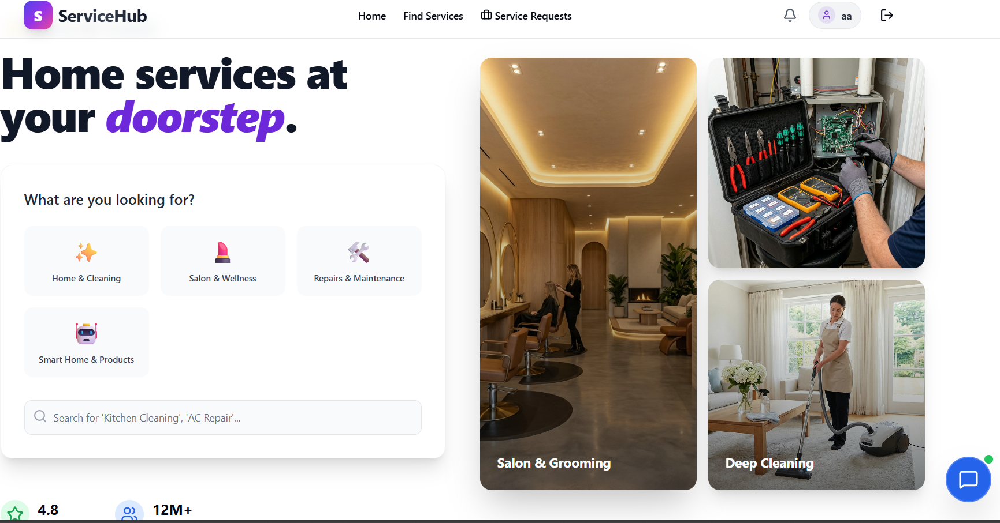

# 🛠️ ServiceHub - Professional Service Platform

ServiceHub is a comprehensive web application designed to connect customers with local service providers (Plumbers, Electricians, Cleaners, etc.) in real-time. It features a robust administration dashboard, secure role-based access, and automated commission calculations.



## 🚀 Key Features

### 👤 Customer Features
- **Smart Service Search**: AI-powered search (Gemini) to find the right service.
- **Easy Booking**: Seamless booking flow with real-time status tracking.
- **Location Awareness**: Integrated Geolocation for precise service delivery.
- **Complaint System**: Raise and track complaints directly from the dashboard.

### 💼 Provider Features
- **Strict Categorization**: Providers see only requests matching their verified service category.
- **Live Dashboard**: Real-time job requests and status management (Accept/Decline/Start/Complete).
- **Earnings Tracker**: View daily and total earnings with transparent platform fee deduction.


### 🛡️ Admin Portal (Hidden & Secured)
- **Centralized Management**: Approve/Reject service providers and manage customer profiles.
- **Revenue Analytics**: Track total platform revenue and platform fees (3% commission).
- **Complaint Resolution**: View and manage customer disputes.
- **Security**: Hidden login portal with rate-limiting and strictly enforced role protection.


## 💻 Tech Stack

- **Frontend**: React.js, Tailwind CSS, Lucide Icons, Redux Toolkit
- **Backend**: Node.js, Express.js, MongoDB (Mongoose)
- **Auth**: Firebase Auth (Google Sign-In) & Custom JWT
- **Real-time**: Socket.IO for instant job notifications
- **AI**: Google Gemini API for Smart Search

## 🛠️ Installation & Setup

1. **Clone the repository**
   ```bash
   git clone https://github.com/brijeshjha123/Service-hub.git
   cd Service-hub
   ```

2. **Frontend Setup**
   ```bash
   cd frontend
   npm install
   # Create .env and add VITE_FIREBASE_API_KEY, etc.
   npm run dev
   ```

3. **Backend Setup**
   ```bash
   cd backend
   npm install
   # Create .env and add MONGO_URI, JWT_SECRET, etc.
   npm start
   ```

## 🔒 Security
- `.env` files are ignored by Git to protect sensitive API keys and credentials.
- All Admin routes are protected by robust backend middleware and rate-limiters.
